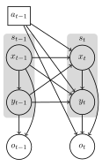

# MOMDPs.jl

**MOMDPs.jl** provides structures and tools for Mixed Observability Markov Decision Processes (MOMDPs) in Julia. It is built on top of the [POMDPs.jl](https://github.com/JuliaPOMDP/POMDPs.jl) framework, extending its functionality to a factorized state space composed of a fully observed state and a partially observed state.

!!! note
    This package is in an initial/early stage. Feedback and contributions are highly encouraged!
    
To integrate MOMDPs.jl with other packages in the JuliaPOMDP ecosystem, you can extend key interface functions within those packages (similar to integrations already implemented in SARSOP.jl, POMDPXFiles.jl, etc.).    

To integreate MOMDPs.jl with other packages in the JuliaPOMDP ecosystem, you can extend the required functions within this package. If you want to define your problem as a MOMDP, but use existing solvers, you can use the [`POMDP_of_Discrete_MOMDP`](@ref) type as it ...

## What are MOMDPs?

A MOMDP is a variant of the Partially Observable Markov Decision Process with a factored state: parts of the state are fully observed, and parts are partially observed. This can lead to more efficient planning solutions for domains that exhibit such structure.

Throughout this package, we will use the notation from [Ong, Sylvie CW, et al. "POMDPs for robotic tasks with mixed observability." Robotics: Science and systems. Vol. 5. No. 4. 2009.](https://www.comp.nus.edu.sg/~leews/publications/rss09.pdf).

We assume the MOMDP is of the following form (same diagram as from Figure 1 in Ong et al. 2009):

```@raw html

```

A MOMDP is specified by the tuple $(\mathcal{X}, \mathcal{Y}, \mathcal{A}, \mathcal{O}, T_x, T_y, O, R, γ)$, where
-  $\mathcal{X}$ is the set of fully observed states
-  $\mathcal{Y}$ is the set of partially observed states
-  $\mathcal{A}$ is the set of actions
-  $\mathcal{O}$ is the set of observations
-  $T_x(x, y, a, x^\prime) = p(x^\prime \mid x, y, a)$ is the probability of transitioning to state $x^\prime$ from the current state $(x, y)$ and performing action $a$.
-  $T_y(x, y, a, x^\prime, y^\prime) = p(y^\prime \mid x, y, a, x^\prime)$ is the probability of transitioning to state $y^\prime$ after performing action $a$ in state $(x, y)$ and the fully observable state is $x^\prime$.
-  $O = p(o \mid x, y, a)$ is the probability of observing $o$ given the current state $(x, y)$ and action $a$.
-  $R = r(x, y, a)$ is the reward for taking action $a$ in state $(x, y)$.
-  $\gamma$ is the discount factor.

## Installation

You can install MOMDPs.jl using the Julia package manager:
```julia
] add "git@github.com:JuliaPOMDP/MOMDPs.jl.git"
```
 
MOMDPs.jl is built on top of POMDPs.jl and extends various other packages in the JuliaPOMDP ecosystem. When using MOMDPs.jl, you will also need these other packages. As a default, we recommend including `POMDPs` and `POMDPTools`.

## Documentation Outline


```@contents
Pages = reduce(vcat, map(last, Main.page_order))
Depth = 3
```